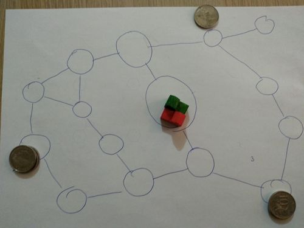
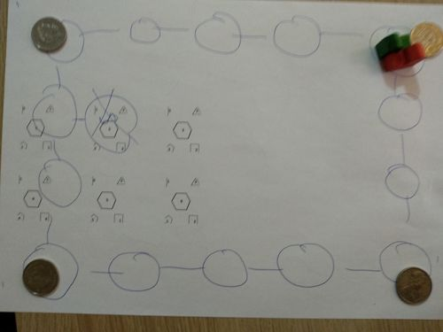

Movement
================
Using the Assets/DiceCards/DiceCards.sla and the D6 dice.

Tried a Talisman type board with a square of connected circles:

Also tried a map with more routes:

Lessons learnt

1. The more routes there are on the map itself, the more ways there are to "burn off" dice movement points, to reach the goal easier
2. A pool of 1 or 2 cards, pickup one, use one is way better than dice (RECOMMENDED).
    1. It gives the player the feeling of choice while not overly giving them a bigger advantage than dice.
    2. We decided that picking up 2 and discarding one would just be too much effort.
    3. This method if movement also allows for simultaneous player movement, although you will want a turn timer, we decided against this (except for speed play) as the player feels disconnected from the other plays and there is less cooperating - helping each other plan their moves.
