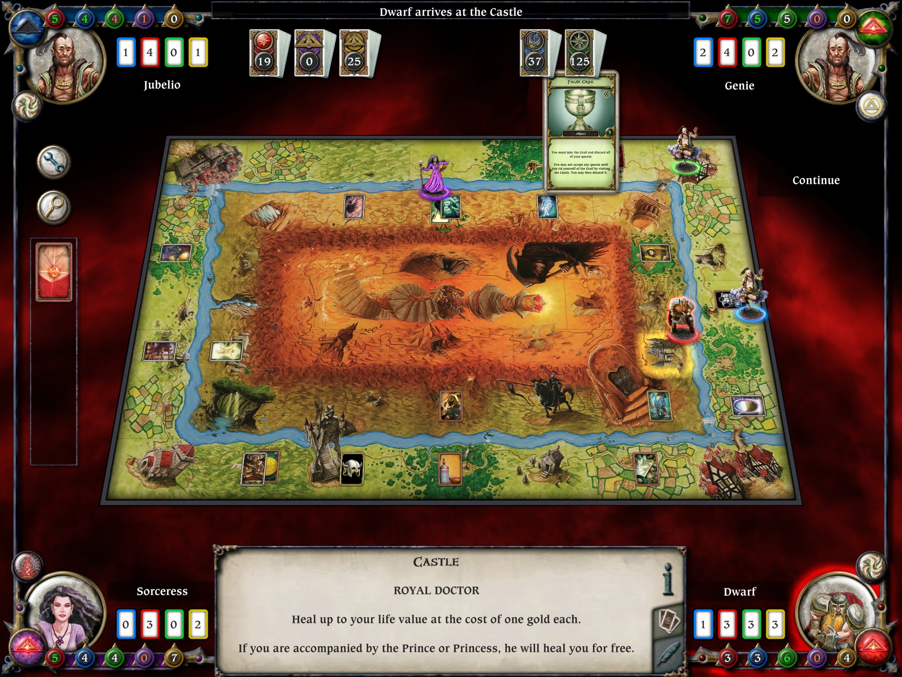
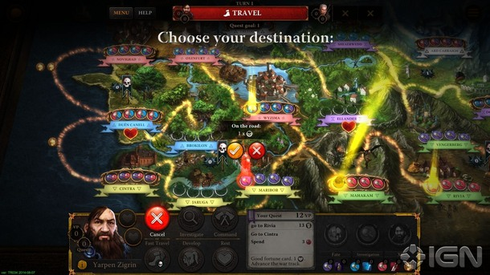
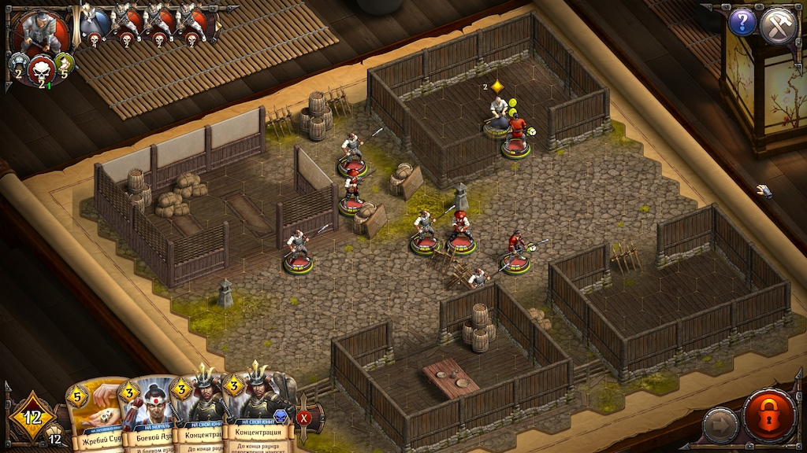

The base premise
===================
Something like Talisman but the RNG dice rolls replaced with cards.

A game we can play hot-seat on the couch for a few hours.

Cooperative mode
======================
Then we make it cooperative by making it tower defense.
A map the players move around from tile to tile.
A count down before a wave of enemies spawns.
As the players go around collecting resources, building towers and leveling up, negative cards can also drop which determine what enemies will spawn in the next wave(s), apply negative penalties etc.

PvP mode
======================
Low priority

Art style
================
Make is board gamey, and the UI should be all ingame as if you are playing a board game.
This means we can do VR at some stage.
It also means we work on mobile, PC.
We might even make it a board game with 3d resin printer.
Fixed camera with isometric view so we can render nice quality sprites and make it look pretty with super low poly.
Having a board game means we can test things without needing a PC - ie. while away camping for example.

Game to research from
========================
Talisman

The Witcher Adventure Game

Warbands

